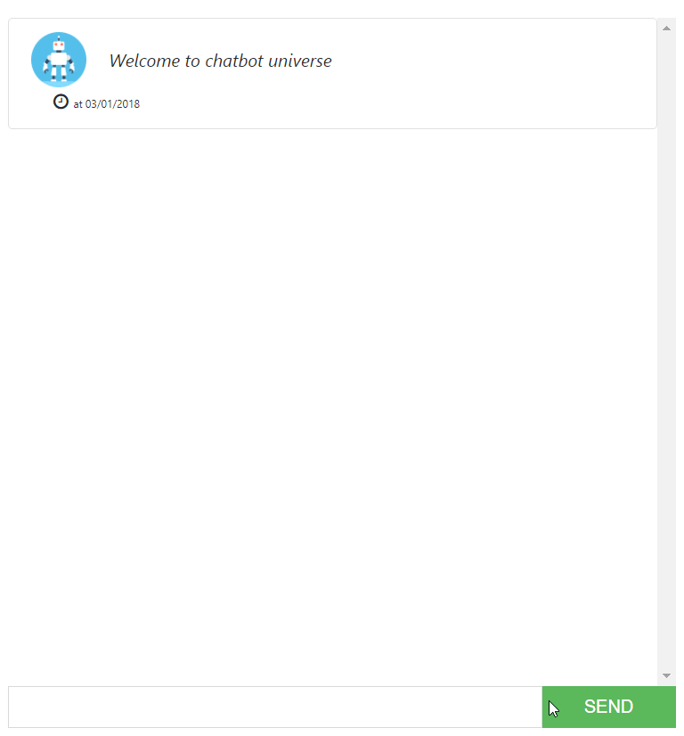

# SmartBot

SmartChat with Angular 5 & DialogFlow 

<p align="center">
  
</p>

## Run

```
ng serve
```

* Make sure to update the environments/environment.ts with your own DialogFlow Client Access Token.
